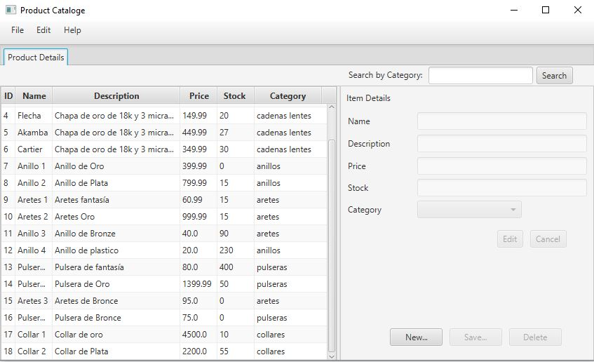
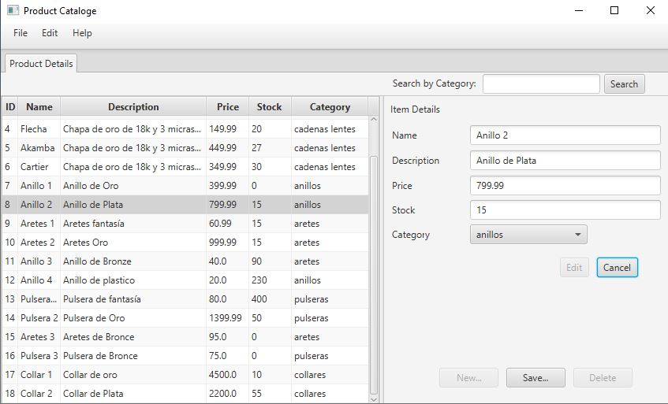
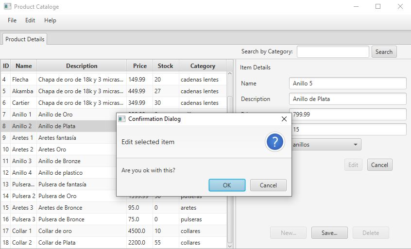
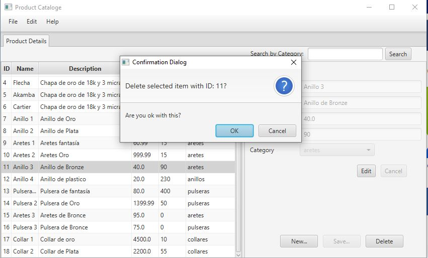
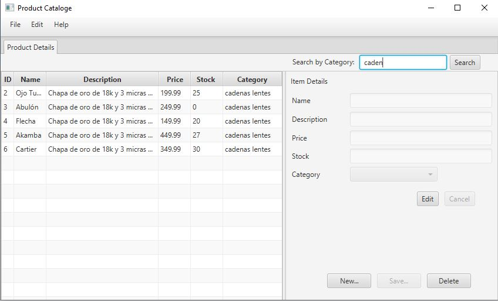

# Jewelry Cataloge App - Java MVC
Java Application - Product Cataloge for Online Store. 

The following application implements a simple MVC Java Core application. The purpose of the application is to manage the product catalog of an online store. 
<ul>Features: 
  <li>Add Items</li>
  <li>Edit items</li>
  <li>Remove Items  (Academic purpose)</li>
  <li>Search by Category.</li>
</ul>

JavaFX with Scene Builder (Gluon) has been used to implement the views. The app was implemented using Netbeans 8.0 and JDBC connector for MySQL integration. No framework was used in the development only Java Core was used. 
All data has been stored in MySQL 8.0 a simple schema was created for store the items and categories of each one of the products. 

Below are some screenshots of the views: 

State of the application when no item is selected.
 
 

Select an item from the table to edit the details of the product.
 
 

Dialog box appears to confirm the actions of the user.
 
 

Verify that the items selected is the correct item to be deleted. 
 
 

Search box to filter items by category.

